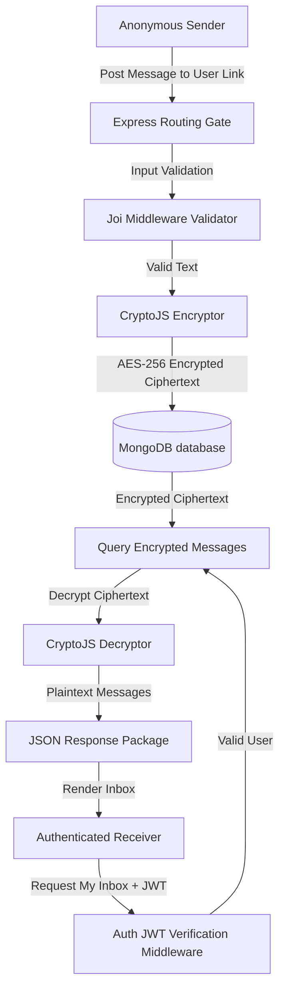

# 🔒 Sharaha - Secure Anonymous Messaging API Backend

<div align="center">
  
</div>

A production-grade, highly secure, and encrypted anonymous feedback and messaging API backend. Built using Node.js, Express 5.x, and MongoDB, this application prioritizes absolute data privacy and integrity. It leverages advanced cryptographic algorithms to ensure that messages are encrypted end-to-end, making them unreadable by anyone—including database administrators.

---

## 🚀 Key Features

* **🛡️ End-to-End Cryptography**: Advanced database-level message encryption using `Crypto-JS` (AES-256). All incoming anonymous feedback is encrypted before writing to MongoDB and decrypted only when requested by the authenticated owner.
* **🔑 Secure Identity Protocol**: State-of-the-art password hashing using `Bcrypt` and stateless user authorization using industry-standard `JSON Web Tokens (JWT)`.
* **📧 Verification Mailer**: Automatic email dispatch powered by `Nodemailer` for user activation, email confirmation, and secure password reset tokens.
* **⚡ Strict Schema Validation**: Bulletproof input sanitization using `Joi` validation schemas at the routing gate to intercept malicious payloads.
* **📂 Modular Architecture**: Structured MVC architecture separating business logic into clean folders (`Auth`, `User`, and `Messages`).

---

## 🧬 Architecture & Cryptographic Flow

Here is how anonymous messages are sent, encrypted at rest, and securely retrieved by the target user:



---

## 🛠️ Technology Stack & Badges

### Core Frameworks
[](https://nodejs.org/)
[](https://expressjs.com/)
[](https://www.mongodb.com/)
[](https://mongoosejs.com/)

### Security & Mail
[](https://cryptojs.gitbook.io/)
[](https://www.npmjs.com/package/bcrypt)
[](https://jwt.io/)
[](https://nodemailer.com/)

---

## 📂 Folder Structure

```text
Sharaha Application/
├── index.js               # Web Server Entrypoint & HTTP Bootstrap
├── app.controller.js      # Global Middlewares (CORS, body parser), Database Connections
├── jsconfig.json          # Path mapping & JS IntelliSense configuration
├── src/
│   ├── DataBase/          # Connection handler & mongoose models
│   │   ├── connection.js
│   │   └── Models/
│   │       ├── Message.model.js
│   │       └── User.model.js
│   ├── middelware/        # Request handling and security filters
│   │   ├── auth.middleware.js
│   │   └── validation.middleware.js
│   ├── utils/             # Helper utilities & cryptographic wrappers
│   │   ├── sendEmail.js
│   │   └── crypto.js
│   └── Modules/           # Main business feature groups
│       ├── Auth/          # Signup, activation links, token signing, reset passwords
│       ├── Messages/      # Anonymous message dispatch, fetch inbox, delete entries
│       └── User/          # Profile retrieval, visibility toggles, account termination
```

---

## 🚀 Getting Started

### Prerequisites
- Node.js (v20.x or above)
- MongoDB running locally or a MongoDB Atlas URI
- SMTP configuration details (e.g., Gmail App Password or Mailtrap)

### Installation
1. Clone the codebase:
   ```bash
   git clone https://github.com/Sayed-Herzallah/Sharaha-Application.git
   cd Sharaha-Application
   ```
2. Install dependencies:
   ```bash
   npm install
   ```
3. Configure the environment variables in a `.env` file in the root folder:
   ```env
   PORT=3000
   MONGO_URI=mongodb://127.0.0.1:27017/sharaha
   JWT_SECRET=your_jwt_signature_key
   CRYPTO_SECRET=your_aes_encryption_key
   
   SMTP_HOST=smtp.gmail.com
   SMTP_PORT=465
   SMTP_SECURE=true
   SMTP_USER=your_email@gmail.com
   SMTP_PASS=your_gmail_app_password
   ```
4. Run locally:
   ```bash
   npm start
   ```

---

## 📜 Verified Certificates & Achievements
To review verified technical accomplishments, backend training, and professional project portfolios, click below:

[](https://herzallah.me#certifications)

---

## 👨‍💻 Developed By
**Sayed Herzallah**  
*Backend-Focused Full-Stack Developer*  
- [LinkedIn Profile](https://www.linkedin.com/in/sayed-herzallah)  
- [Portfolio Website](https://herzallah.me)  
- [GitHub Profile](https://github.com/Sayed-Herzallah)  
