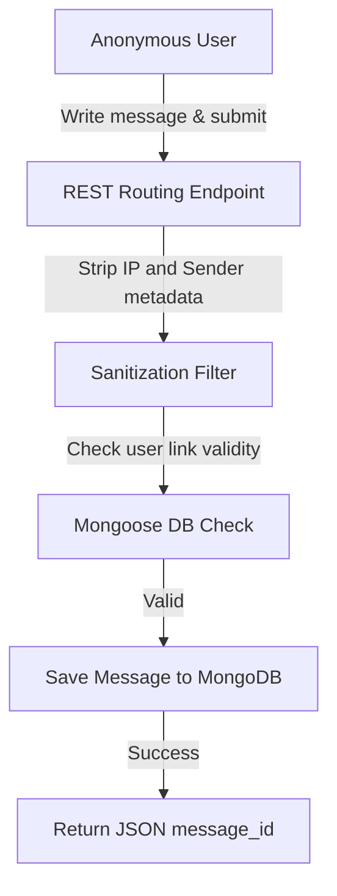

# Sharaha Anonymous Messaging API: Secure Backend & Privacy-Focused Gateway

<div align="center">
  
</div>

<div align="center">
     
</div>

خادم **منصة صراحة للمصارحة** هو خادم برمجيات خلفي مبني باستخدام Express وقاعدة بيانات MongoDB لمعالجة الرسائل المجهولة وإدارتها بشكل يحمي خصوصية البيانات ويمنع تسرب هويات المرسلين.

This repository houses the secure backend RESTful API, authentication handlers, and messaging database tables for the **Sharaha Anonymous Feedback App**.

---

## 🧬 Anonymous Message Flow

The system processes incoming anonymous statements and logs them securely:



---

## 🧬 Core Services & Layouts

1.  **Anonymizer Filter (`src/controllers/messages.js`)**: Sanitizes incoming message bodies while avoiding tracking sender metadata.
2.  **User Authentication (`src/controllers/auth.js`)**: JWT access tokens and bcrypt hashing protect recipient inbox access.

---

## 🛠️ Technology Stack & Assets

*   **Runtime Backend**: Node.js & Express.js.
*   **Database Engine**: MongoDB NoSQL database using Mongoose ODM.
*   **Security Framework**: JWT token authentication and CORS access restrictions.

---

## 📂 Repository Module Layout

```text
sharaha-app-api/
├── src/
│   ├── controllers/     # Message handling and auth execution logic
│   ├── models/          # MongoDB Schemas (Users, Messages)
│   ├── routes/          # RESTful endpoint paths
│   └── app.js           # Server application startup configurations
├── package.json         # Node metadata
└── README.md            # System documentation
```

---

## ⚡ Local Setup & Run
```bash
git clone https://github.com/Sayed-Herzallah/sharaha-app-api.git
cd sharaha-app-api
npm install
# Configure MONGO_URI inside config/.env
npm start
```

---

## 📄 License
Licensed under the **MIT License**.
